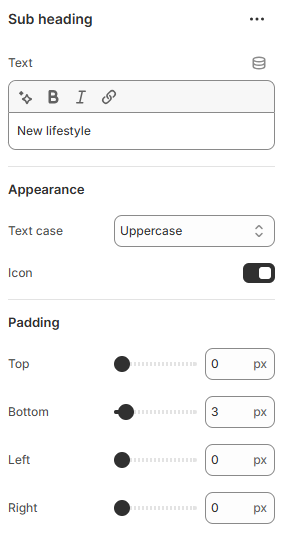

# Sub Heading

A Subheading is used to display secondary titles or supporting labels for a section. It helps clarify content, add context, and improve visual hierarchy without overpowering the main heading.

<figure><figcaption></figcaption></figure>

| Text           | Add the text for the subheading                                                      |
| -------------- | ------------------------------------------------------------------------------------ |
| **Appearance** | ​                                                                                    |
| Text case      | Use the Text case setting to adjust the text style. (Uppercase, Capitalize, Default) |
|                |                                                                                      |
| Padding        | Adjust the padding range around the slider content.(Top, Bottom, Left, Right)        |
