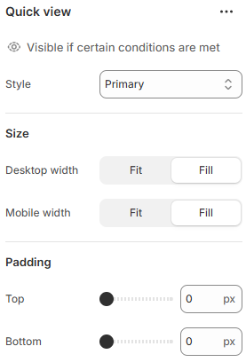

# Quick view

Allows customers to preview product details in a popup without leaving the current page.

<figure><figcaption></figcaption></figure>

| Style         | Select the button style. (Primary, Secondary, Link ) Note: According to the selected button style, the button background and hover background color get changed. |
| ------------- | ---------------------------------------------------------------------------------------------------------------------------------------------------------------- |
| **Size**      | ​                                                                                                                                                                |
| Desktop width | Set the button width for desktop view. (Fit, Fill)                                                                                                               |
| Mobile width  | Set the button width for mobile view. (Fit, Fill)                                                                                                                |
| Padding       | Adjust the vertical padding of the section to control spacing. (Top, Bottom)                                                                                     |
