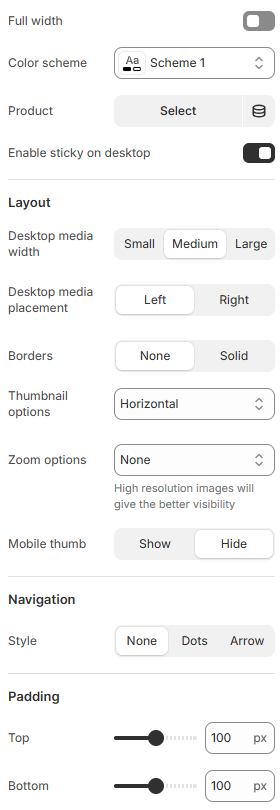

---
metaLinks:
  alternates:
    - https://app.gitbook.com/s/hbuQuZovtBBsMP54qBxh/sections/featured-product
---

# Featured Product

The **Featured Products** section allows you to highlight selected products on your homepage or any other page. It’s perfect for showcasing **best-sellers**, **new arrivals**, or **promotional items**, making it easier for customers to discover key products at a glance.

**To add this section:**

1. In your Shopify admin, go to **Online Store > Themes**.
2. Click **Customize** on your active theme.
3. In the theme editor, click **Add section** and select **Featured Products**.

You can then configure the section settings to choose which products to display and customize the layout to match your store’s design.

<figure><figcaption></figcaption></figure>

|                          |                                                                                      |
| ------------------------ | ------------------------------------------------------------------------------------ |
| Full width               | Enable for full-width view. (Controls the container width)                           |
| Color scheme             | Select any color scheme defined in the theme settings > Colors > Schemes.            |
| Product                  | Choose a specific product to be featured in this section.                            |
| Enable sticky on desktop | Enable to see the sticky on the product image.                                       |
| **Layout**               |                                                                                      |
| Desktop media width      | Adjust the width of the product image for the desktop layout. (Small, Medium, Large) |
| Desktop media placement  | Select the position of the product. (Left, Right)                                    |
| Borders                  | Select the style of the border.                                                      |
| Thumbnail options        | Choose the thumbnail layout. (Stacked, Horizontal, Vertical)                         |
| Zoom options             | Enable to view the product with zoom option.                                         |
| Mobile thumb             | Select to show the thumb image on mobile.                                            |
| **Navigation**           |                                                                                      |
| Style                    | Choose pagination style. (Dots, Arrow, None )                                        |
| Padding                  | Adjust the vertical padding of the section to control spacing. (Top, Bottom)         |
