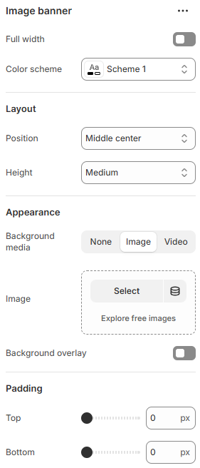

---
metaLinks:
  alternates:
    - https://app.gitbook.com/s/hbuQuZovtBBsMP54qBxh/sections/image-banner
---

# Image Banner

The **Image with Text** section lets you place an image next to supporting content to create a clean, eye-catching layout. It’s ideal for highlighting promotions, sharing brand stories, or drawing attention to key messages with strong visual impact—similar to an image banner but with added text flexibility.

How to add it:

1. Go to **Shopify Admin → Online Store → Themes**
2. Click **Customize** on your active theme
3. In the Theme Editor, select **Add section → Image with Text**

<figure><figcaption></figcaption></figure>

|                    |                                                                                                                                                                                                                                                                                                   |
| ------------------ | ------------------------------------------------------------------------------------------------------------------------------------------------------------------------------------------------------------------------------------------------------------------------------------------------- |
| Full width         | Enable for full width view. (Controls the container width)                                                                                                                                                                                                                                        |
| Color scheme       | Select any color scheme defined in the theme settings > Colors > Schemes.                                                                                                                                                                                                                         |
| **Layout**         |                                                                                                                                                                                                                                                                                                   |
| Position           | 
Set where the content appears within the container.
<ul><li>Left</li><li>Center</li><li>Right</li><li>Top left</li><li>Top center</li><li>Top right</li><li>Middle left</li><li>Middle center</li><li>Middle right</li><li>Bottom left</li><li>Bottom center</li><li>Bottom right</li></ul> |
| Height             | Select the height for the section. (Small, Medium, Large)                                                                                                                                                                                                                                         |
| **Appearance**     |                                                                                                                                                                                                                                                                                                   |
| Background media   | Select the background type for the section.                                                                                                                                                                                                                                                       |
| Image              | Add the image.                                                                                                                                                                                                                                                                                    |
| Background overlay | Enable to apply overlay on the image.                                                                                                                                                                                                                                                             |
| Overlay color      | Pick the overlay color.                                                                                                                                                                                                                                                                           |
| Overlay color      | Select the overlay style. (Solid, gradient)                                                                                                                                                                                                                                                       |
| Padding            | Adjust the vertical padding of the section to control spacing. (Top, Bottom)                                                                                                                                                                                                                      |
