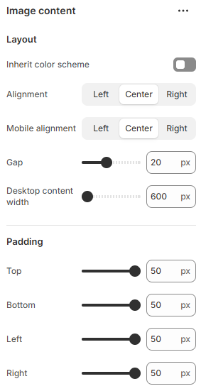

---
metaLinks:
  alternates:
    - >-
      https://app.gitbook.com/s/hbuQuZovtBBsMP54qBxh/sections/image-banner/image-content
---

# Image Content

Image Content is used to combine images with supporting content. It helps visually communicate information in an engaging way.

<figure><figcaption></figcaption></figure>

|                       |                                                                              |
| --------------------- | ---------------------------------------------------------------------------- |
| **Layout**            |                                                                              |
| Inherit color scheme  | Inherit the color scheme from the global theme settings.                     |
| Alignment             | Choose the alignment of the text on desktop view. &#xD;(Left, Center, Right) |
| Mobile alignment      | Choose the alignment of the text on mobile view. &#xD;(Left, Center, Right)  |
| Gap                   | Adjust the gap between the content.                                          |
| Desktop content width | Adjust the content width for the desktop.                                    |
| Padding               | Adjust the padding range around the section. (Top, Bottom, Left, Right)      |
