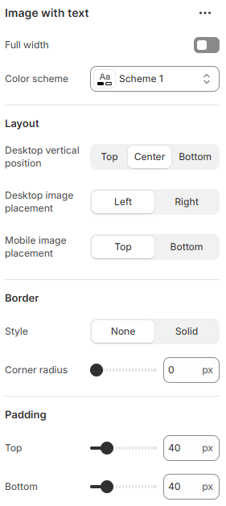

---
metaLinks:
  alternates:
    - https://app.gitbook.com/s/hbuQuZovtBBsMP54qBxh/sections/image-with-text
---

# Image With Text

The **Image with Text** section allows you to display an image alongside text, creating a visually appealing layout that enhances storytelling, promotions, or brand messaging.

1. **Go to** Shopify Admin > **Online Store > Themes**.
2. Click **Customize** on your active theme.
3. In the Theme Editor, click **Add Section > Image with Text**.

<figure><figcaption></figcaption></figure>

|                           |                                                                              |
| ------------------------- | ---------------------------------------------------------------------------- |
| Full width                | Enable for full width view. (Controls the container width)                   |
| Color scheme              | Select any color scheme defined in the theme settings > Colors > Schemes.    |
| **Layout**                |                                                                              |
| Desktop vertical position | Align text content for desktop view. (Top, Center, Bottom)                   |
| Desktop image placement   | Select the position of the image on desktop view. (Left, Right)              |
| Mobile image placement    | Select the position of the image on mobile view. (Top, Bottom)               |
| **Border**                |                                                                              |
| Style                     | Select the style of the border for the block.                                |
| Corner radius             | Adjust the corner radius width.                                              |
| Padding                   | Adjust the vertical padding of the section to control spacing. (Top, Bottom) |
