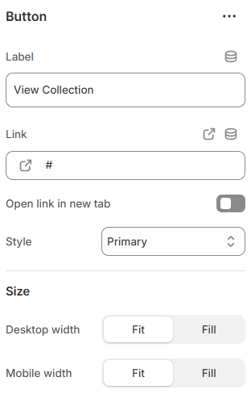

---
metaLinks:
  alternates:
    - >-
      https://app.gitbook.com/s/hbuQuZovtBBsMP54qBxh/sections/image-with-text/header-block/button
---

# Button

A Button is used to guide customers to specific actions or pages. It helps improve navigation and drive engagement.

<figure><figcaption></figcaption></figure>

| Label                | Enter the button text.                                                                                                                                        |
| -------------------- | ------------------------------------------------------------------------------------------------------------------------------------------------------------- |
| Link                 | Add the URL for the button.                                                                                                                                   |
| Open link in new tab | Enable to open the link in a new browser tab.                                                                                                                 |
| Style                | Select the button style. (Primary, Secondary, Link ) Note: According to the selected button style, button background and hover background color gets changed. |
| **Size**             | ​                                                                                                                                                             |
| Desktop width        | Set the button width for desktop view.(Fit, Custom) Note: When ‘Custom’ is selected, you can manually adjust the content width range.                         |
| Mobile width         | Set the button width for mobile view.(Fit, Custom) Note: When ‘Custom’ is selected, you can manually adjust the content width range.                          |
