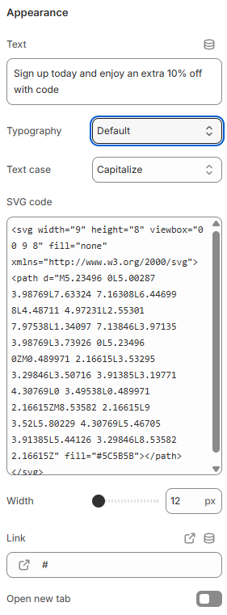

---
metaLinks:
  alternates:
    - >-
      https://app.gitbook.com/s/hbuQuZovtBBsMP54qBxh/sections/marquee/content-block/marquee-content
---

# Marquee content

Marquee Content is used to add scrolling text or elements within the marquee section. It helps highlight announcements, offers, or key messages dynamically.

<figure><figcaption></figcaption></figure>

|              |                                                                                                                                |
| ------------ | ------------------------------------------------------------------------------------------------------------------------------ |
| Text         | Add the text for the marquee content.                                                                                          |
| Typography   | Select the option from the typography. According to the selected option you will be adjusted to the font family and font size. |
| Text case    | Use the Text case setting to adjust the text style. (Uppercase, Capitalize, Default)                                           |
| SVG code     | Add svg code here.                                                                                                             |
| Width        | Adjust the width of the svg icon.                                                                                              |
| Link         | Add the link for the icon.                                                                                                     |
| Open new tab | Enable to open the link in a new browser tab.                                                                                  |
