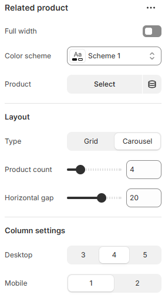
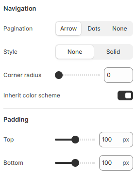

---
metaLinks:
  alternates:
    - https://app.gitbook.com/s/hbuQuZovtBBsMP54qBxh/sections/related-product
---

# Related Product

<figure><figcaption></figcaption></figure> <figure><figcaption></figcaption></figure>

|                      |                                                                              |
| -------------------- | ---------------------------------------------------------------------------- |
| **Layout**           |                                                                              |
| Full width           | Enable full-width view. (Controls the container width)                       |
| Color scheme         | Select any color scheme defined in the theme settings > Colors > Schemes.    |
| Product              | Select product to display its related products.                              |
| **Layout**           |                                                                              |
| Type                 | Select the layout type. (Grid, Carousel)                                     |
| Product count        | Adjust the product count .                                                   |
| Horizontal gap       | Adjust spacing between products.                                             |
| **Column settings**  |                                                                              |
| Desktop              | Select the collection card to display on the desktop screen.                 |
| Mobile               | Select the collection card to display on the mobile screen.                  |
| **Navigation**       |                                                                              |
| Pagination           | Choose pagination style. (Dots, Arrow, None )                                |
| Style                | Select the border style.                                                     |
| Thickness            | Adjust the thickness of the border.                                          |
| Corner radius        | Adjust the corner radius of the border.                                      |
| Opacity              | Adjust the opacity range of the border.                                      |
| Inherit color scheme | Inherit the color scheme from the global theme settings.                     |
| Padding              | Adjust the vertical padding of the section to control spacing. (Top, Bottom) |
