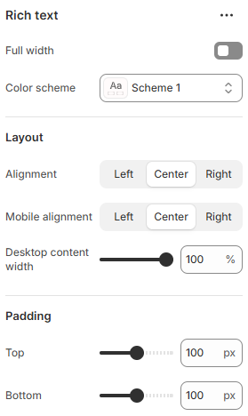

# Rich Text

The **Rich Text Section** allows you to add customizable text content to your store’s pages. It is ideal for displaying **announcements, brand messaging, promotional details, or any important information** in a structured format.

1. **Go to** Shopify Admin > Online Store > Themes.
2. **Click** Customize on your active theme.
3. In the theme editor, **click** Add Section > Rich Text.

<figure><figcaption></figcaption></figure>

| Full width            | Enable for full-width view. (Controls the container width)                   |
| --------------------- | ---------------------------------------------------------------------------- |
| Color scheme          | Select any color scheme defined in the theme settings > Colors > Schemes.    |
| **Layout**            | ​                                                                            |
| Alignment             | Choose the alignment of the text. (Left, Center, Right)                      |
| Desktop content width | Adjust the desktop content width.                                            |
| Padding               | Adjust the vertical padding of the section to control spacing. (Top, Bottom) |
