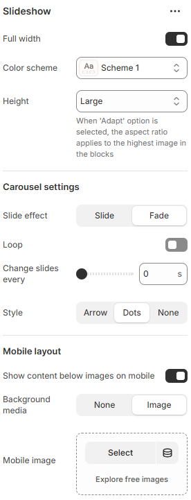

---
metaLinks:
  alternates:
    - https://app.gitbook.com/s/hbuQuZovtBBsMP54qBxh/sections/slideshow
---

# Slideshow

The Slideshow, sometimes referred to as a banner or carousel, is a well-liked area that lets you display one or more full-page photographs (and/or videos); it is only accessible on our Prestige and Impact themes. To make a lasting impression on your clients, a slideshow is usually the first section on the home page.

1. Go to **Shopify Admin > Online Store > Themes.**
2. Click **Customize** on your live theme.
3. In the theme editor, **click** **Templates** > Slideshow.
4. Click **Save.**

<figure><figcaption></figcaption></figure>

|                                     |                                                                                        |
| ----------------------------------- | -------------------------------------------------------------------------------------- |
| Full width                          | 
Enable for full width view. 

(Controls the container width)
               |
| Color scheme                        | Select any color scheme defined in the theme settings > Colors > Schemes.              |
| Height                              | Select the height of the slideshow image. (Small, Medium, Large, Adapt).               |
| **Carousel settings**               |                                                                                        |
| Slide effect                        | Select the sliding effect.(Slide, Fade)                                                |
| Loop                                | Enable to loop of the slides.                                                          |
| Change slides every                 | Customize the slide's delay time in seconds.                                           |
| Style                               | Choose pagination style. (Dots, Arrow, None)                                           |
| **Mobile layout**                   |                                                                                        |
| Show content below images on mobile | Enable the option to show the content below the image on the mobile device.            |
| Background media                    | Select the type of the background media. ( None, Image )                               |
| Mobile image                        | Add the image for mobile view.                                                         |
| Padding                             | Adjust the vertical padding of the slideshow section to control spacing. (Top, Bottom) |
