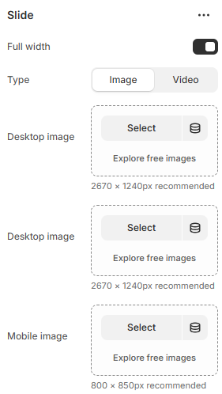
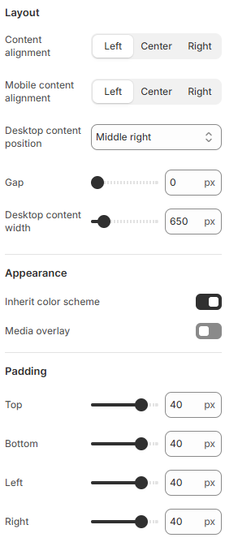

---
metaLinks:
  alternates:
    - >-
      https://app.gitbook.com/s/hbuQuZovtBBsMP54qBxh/sections/slideshow/slide-block
---

# Slide Block

A Slide Block is used to add individual slides within the slideshow section. It helps showcase images, promotions, or key messages in a rotating format.

<figure><figcaption></figcaption></figure> <figure><figcaption></figcaption></figure>

|                          |                                                                                                                                                                                                                                                                                                       |
| ------------------------ | ----------------------------------------------------------------------------------------------------------------------------------------------------------------------------------------------------------------------------------------------------------------------------------------------------- |
| **Slide**                |                                                                                                                                                                                                                                                                                                       |
| Full width               | 
Enable for full width view. 

(Controls the container width)
                                                                                                                                                                                                                              |
| Type                     | Select the type of the image/video.                                                                                                                                                                                                                                                                   |
| Desktop image            | Select the image for desktop resolution.                                                                                                                                                                                                                                                              |
| Desktop image            | Select the image for desktop resolution.                                                                                                                                                                                                                                                              |
| Mobile image             | Select the image for mobile resolution.                                                                                                                                                                                                                                                               |
| **Layout**               |                                                                                                                                                                                                                                                                                                       |
| Content alignment        | 
Align text content for desktop view. 

(Left, Center, Right)
                                                                                                                                                                                                                              |
| Mobile content alignment | 
Align text content for mobile view.

(Left, Center, Right)
                                                                                                                                                                                                                                |
| Desktop content position | 
Set where the content appears within the slide.
<ul><li>Left</li><li>Center</li><li>Right</li><li>Top left</li><li>
Top center</li><li>Top right</li><li>
Middle left</li><li>
Middle center</li><li>
Middle right</li><li>
Bottom left</li><li>
Bottom center</li><li>
Bottom right</li></ul> |
| Gap                      | Adjust spacing between content elements within the slide.                                                                                                                                                                                                                                             |
| Desktop content width    | Adjust the content width on the desktop.                                                                                                                                                                                                                                                              |
| **Appearance**           |                                                                                                                                                                                                                                                                                                       |
| Inherit color scheme     | Inherit the color scheme from the global theme settings.                                                                                                                                                                                                                                              |
| Media overlay            | Enable overlay to display color over the image for text readability.                                                                                                                                                                                                                                  |
| Padding                  | Adjust the padding range around the slider content. (Top, Bottom, Left, Right)                                                                                                                                                                                                                        |
