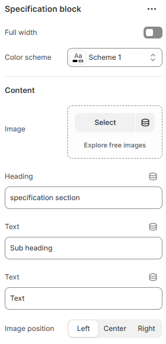

---
metaLinks:
  alternates:
    - >-
      https://app.gitbook.com/s/hbuQuZovtBBsMP54qBxh/sections/specification-block
---

# Specification Block

The **Specification Block** is used to display detailed product information in a clear and structured format. It’s ideal for highlighting key features, technical details, materials, dimensions, or other important specifications that help customers make informed purchasing decisions.

<figure><figcaption></figcaption></figure> <figure><figcaption></figcaption></figure>

|                      |                                                                              |
| -------------------- | ---------------------------------------------------------------------------- |
| Full width           | Enable for full-width view. (Controls the container width)                   |
| Color scheme         | Select any color scheme defined in the theme settings > Colors > Schemes.    |
| **Content**          |                                                                              |
| Image                | Add image to the block.                                                      |
| Heading              | Add the heading to the image block.                                          |
| Sub heading          | Add the sub heading to the image block.                                      |
| Text                 | Add the text description to the image block.                                 |
| Image position       | Select the image positon. (Left, Right, Center)                              |
| Placement            | Select the content placement on the image. (On image, Below image)           |
| Alignment            | Align text content for desktop view. (Left, Center, Right)                   |
| Mobile alignment     | Align text content for mobile view. (Left, Center, Right)                    |
| Position             | Adjust the position of the text.                                             |
| Inherit color scheme | Inherit the color scheme from the global theme settings.                     |
| Gap                  | Adjust the gap range.                                                        |
| Padding              | Adjust the vertical padding of the section to control spacing. (Top, Bottom) |
