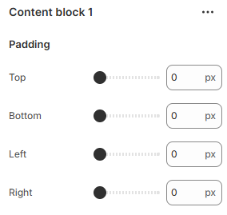

---
metaLinks:
  alternates:
    - >-
      https://app.gitbook.com/s/hbuQuZovtBBsMP54qBxh/sections/specification-block/content-block-1
---

# Content block 1

<figure><figcaption></figcaption></figure>

**Padding:** Adjust the padding range around the section. (Top, Bottom, Left, Right)
