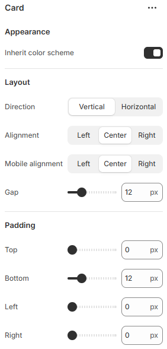

---
metaLinks:
  alternates:
    - >-
      https://app.gitbook.com/s/hbuQuZovtBBsMP54qBxh/sections/specification-block/content-block-1/card
---

# Card

A Card is used to display grouped content in a structured layout. It helps present information, images, or actions in a clear and visually organized way.

<figure><figcaption></figcaption></figure>

|                      |                                                                      |
| -------------------- | -------------------------------------------------------------------- |
| Inherit color scheme | Inherit the color scheme from the global theme settings.             |
| **Layout**           |                                                                      |
| Direction            | Choose the content arrangement direction. (Horizontal, Vertical)     |
| Alignment            | Choose the alignment of the text.&#xD; (Left, Center, Right)         |
| Gap                  | Adjust the spacing between each block.                               |
| Padding              | Adjust the padding range around the card. (Top, Bottom, Left, Right) |
