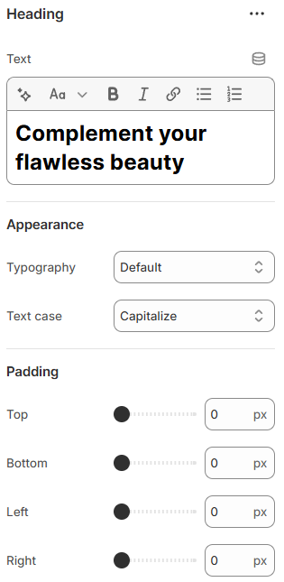

---
metaLinks:
  alternates:
    - >-
      https://app.gitbook.com/s/hbuQuZovtBBsMP54qBxh/sections/specification-block/content-block-1/card/heading
---

# Heading

A Heading is used to display titles or section labels in your store. It helps organize content and improve visual hierarchy.

<figure><figcaption></figcaption></figure>

|                |                                                                                                                                |
| -------------- | ------------------------------------------------------------------------------------------------------------------------------ |
| Text           | Add the text for the slideshow                                                                                                 |
| **Appearance** |                                                                                                                                |
| Typography     | Select the option from the typography. According to the selected option you will be adjusted to the font family and font size. |
| Text case      | Use the Text case setting to adjust the text style. (Uppercase, Capitalize, Default)                                           |
| Padding        | Adjust the padding range around the slider content.(Top, Bottom, Left, Right)                                                  |
