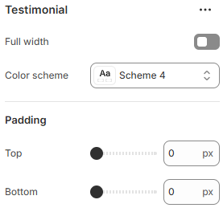

---
metaLinks:
  alternates:
    - https://app.gitbook.com/s/hbuQuZovtBBsMP54qBxh/sections/testimonial
---

# Testimonial

The **Testimonials Section** allows you to showcase customer reviews, feedback, or endorsements, building trust and credibility with potential buyers.

1. **Go to** Shopify Admin > **Online Store > Themes**.
2. Click **Customize** on your active theme.
3. In the Theme Editor, click **Add Section > Testimonials**.

<figure><figcaption></figcaption></figure>

|              |                                                                              |
| ------------ | ---------------------------------------------------------------------------- |
| Full width   | Enable for full-width view. (Controls the container width)                   |
| Color scheme | Select any color scheme defined in the theme settings > Colors > Schemes.    |
| Padding      | Adjust the vertical padding of the section to control spacing. (Top, Bottom) |
