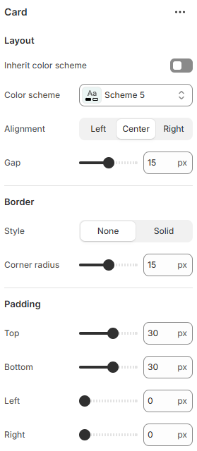

---
metaLinks:
  alternates:
    - https://app.gitbook.com/s/hbuQuZovtBBsMP54qBxh/sections/testimonial/card
---

# Card

A Card is used to display grouped content in a structured layout. It helps present information, images, or actions in a clear and visually organized way.

<figure><figcaption></figcaption></figure>

|                      |                                                                           |
| -------------------- | ------------------------------------------------------------------------- |
| **Layout**           |                                                                           |
| Inherit color scheme | Inherit the color scheme from the global theme settings.                  |
| Color scheme         | Select any color scheme defined in the theme settings > Colors > Schemes. |
| Alignment            | Choose the alignment of the text.&#xD; (Left, Center, Right)              |
| Gap                  | Adjust the gap between contents inside the card.                          |
| **Border**           |                                                                           |
| Style                | Changes the style of the solid border.                                    |
| Corner radius        | Adjust the corner radius width.                                           |
| Padding              | Adjust the padding range around the section. (Top, Bottom, Left, Right)   |
