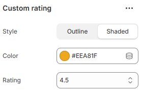

---
metaLinks:
  alternates:
    - >-
      https://app.gitbook.com/s/hbuQuZovtBBsMP54qBxh/sections/testimonial/card/custom-rating
---

# Custom rating

Custom Rating is used to display rating or review information. It helps build trust and highlight customer feedback.

<figure><figcaption></figcaption></figure>

|        |                                                  |
| ------ | ------------------------------------------------ |
| Style  | Select the style of the rating.(Outline, Shaded) |
| Color  | Pick the color to fill the rating icon.          |
| Rating | Select the rating points.                        |
