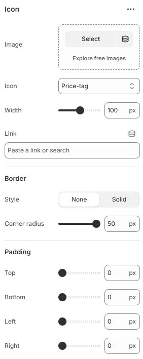

---
metaLinks:
  alternates:
    - >-
      https://app.gitbook.com/s/hbuQuZovtBBsMP54qBxh/sections/testimonial/card/icon
---

# Image

An Icon is used to display small visual symbols. It helps highlight features, actions, or key information quickly.

<figure><figcaption></figcaption></figure>

|               |                                                                                             |
| ------------- | ------------------------------------------------------------------------------------------- |
| Image         | Add the image of the author.                                                                |
| Icon          | 
Select icon from the list. Note: Icon will display only the image field is empty.
 |
| Width         | Adjust the width range.                                                                     |
| Link          | Add the link to the icon.                                                                   |
| **Border**    |                                                                                             |
| style         | Select the border style.                                                                    |
| Corner radius | Adjust the corner radius width.                                                             |
| Padding       | 
Adjust the padding to control spacing. 

(Top, Bottom, Left, Right)
             |
