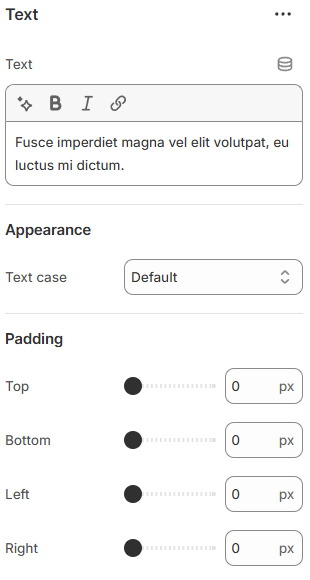

---
metaLinks:
  alternates:
    - >-
      https://app.gitbook.com/s/hbuQuZovtBBsMP54qBxh/sections/testimonial/card/text
---

# Text

Text is used to display written content in your store. It helps communicate information, messages, or descriptions clearly.

<figure><figcaption></figcaption></figure>

|                |                                                                                      |
| -------------- | ------------------------------------------------------------------------------------ |
| Text           | Add the content.                                                                     |
| **Appearance** |                                                                                      |
| Text case      | Use the Text case setting to adjust the text style. (Uppercase, Capitalize, Default) |
| Padding        | Adjust the padding range around the slider content. (Top, Bottom, Left, Right )      |
