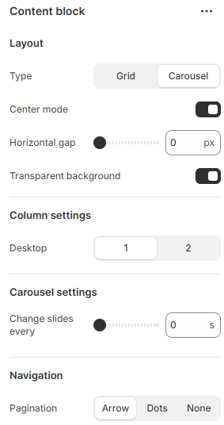
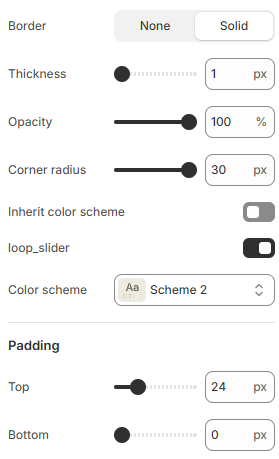

---
metaLinks:
  alternates:
    - >-
      https://app.gitbook.com/s/hbuQuZovtBBsMP54qBxh/sections/testimonial/content-block
---

# Content block

Displays customizable text, images, or media to present information or messaging within a section.

<figure><figcaption></figcaption></figure> <figure><figcaption></figcaption></figure>

|                        |                                                                                        |
| ---------------------- | -------------------------------------------------------------------------------------- |
| **Layout**             |                                                                                        |
| Type                   | Select the layout type. (Grid, Carousel)                                               |
| Center mode            | Enable for center mode.                                                                |
| Horizontal gap         | Adjust the spacing range between the card.                                             |
| Transparent background | Enable for transparent background.                                                     |
| **Column settings**    |                                                                                        |
| Desktop                | Select the card column to display on the desktop screen.                               |
| **Carousel settings**  |                                                                                        |
| Change slides every    | Customize the slide's delay time in seconds.                                           |
| **Navigation**         |                                                                                        |
| Pagination             | Choose the pagination style.                                                           |
| Loop slider            | Enable for slide looping.                                                              |
| Color scheme           | Select any color scheme defined in the theme settings > Colors > Schemes.              |
| Padding                | Adjust the vertical padding of the slideshow section to control spacing. (Top, Bottom) |
