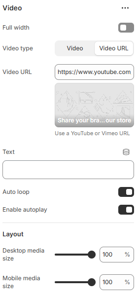
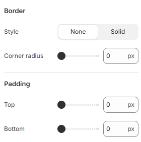

---
metaLinks:
  alternates:
    - https://app.gitbook.com/s/hbuQuZovtBBsMP54qBxh/sections/video
---

# Video

The **Video Section** allows you to embed and showcase videos in your store, providing an engaging way to present **brand stories, product demonstrations, or promotions**.

1. **Go to** Shopify Admin > **Online Store > Themes**.
2. Click **Customize** on your active theme.
3. In the Theme Editor, click **Add Section > Video**.

<figure><figcaption></figcaption></figure> <figure><figcaption></figcaption></figure>

|                    |                                                                              |
| ------------------ | ---------------------------------------------------------------------------- |
| Full width         | Enable full-width view. (Controls the container width)                       |
| Video type         | Select the video type. (Video, Video url)                                    |
| Video URL          | Add the Video url.                                                           |
| Text               | Add the text.                                                                |
| Auto loop          | Enable to auto loop the video.                                               |
| Enable autoplay    | Enable to autoplay the video.                                                |
| Enable controls    | Enable to view controls on the video.                                        |
| **Layout**         |                                                                              |
| Desktop media size | Adjust the range of the media size for desktop.                              |
| Mobile media size  | Adjust the range of the media size for mobile.                               |
| **Border**         |                                                                              |
| Style              | Select the border style.                                                     |
| Corner radius      | Adjust the corner radius of the border.                                      |
| Padding            | Adjust the vertical padding of the section to control spacing. (Top, Bottom) |
