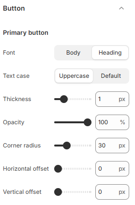

---
metaLinks:
  alternates:
    - https://app.gitbook.com/s/hbuQuZovtBBsMP54qBxh/theme-settings/button
---

# Button

Buttons are essential elements in your Shopify store, guiding users to **add products to the cart, checkout, or explore more pages**. Shopify allows you to customize buttons to match your branding and improve user engagement.

1. **Go to** Shopify Admin > **Online Store > Themes**.
2. Click **Customize** on your active theme.
3. In the Theme Editor, click **Theme Settings > Buttons.**

<figure><figcaption></figcaption></figure> <figure><figcaption></figcaption></figure>

| **Primary button & Secondary button** | ​                                                                                                                              |
| ------------------------------------- | ------------------------------------------------------------------------------------------------------------------------------ |
| Font                                  | Select the option from the typography. According to the selected option you will be adjusted to the font family and font size. |
| Textcase                              | Use the Text case setting to adjust the text style. ( Uppercase, Default )                                                     |
| Thickness                             | Adjust the thickness of the button.                                                                                            |
| Opacity                               | Adjust the opacity range of the button.                                                                                        |
| Corner radius                         | Adjust the corner radius of the button.                                                                                        |
| Horizontal offset                     | Adjusts the shadow position on the X-axis.                                                                                     |
| Vertical offset                       | Adjusts the shadow position on the Y-axis.                                                                                     |
| **Link button**                       | ​                                                                                                                              |
| Font                                  | Select the option from the typography. According to the selected option you will be adjusted to the font family and font size. |
| Testcase                              | Use the Text case setting to adjust the text style. ( Uppercase, Default )                                                     |
