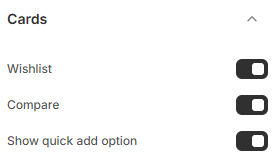

---
metaLinks:
  alternates:
    - https://app.gitbook.com/s/hbuQuZovtBBsMP54qBxh/theme-settings/cards
---

# Cards

**Cards** in Shopify are used to display products, collections, blog posts, or promotions in a structured layout. They typically include an **image, title, price, description, and buttons** (e.g., "Add to Cart" or "View More").

1. **Go to** Shopify Admin > **Online Store > Themes**.
2. Click **Customize** on your active theme.
3. In the Theme Editor, click **Theme Settings > Cards.**

<figure><figcaption></figcaption></figure>

| Wishlist              | Enable wishlist to display on the product card.   |
| --------------------- | ------------------------------------------------- |
| Compare               | Enable compare to display on the product card.    |
| Show quick add option | Enable quick view to display on the product card. |
