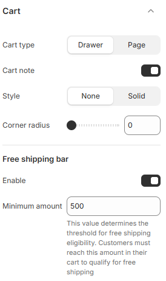

---
metaLinks:
  alternates:
    - https://app.gitbook.com/s/hbuQuZovtBBsMP54qBxh/theme-settings/cart
---

# Cart

The **Cart** in Shopify is where customers review their selected products before proceeding to checkout. You can customize the **cart page, drawer cart (side cart), cart icon, and cart behavior** to improve the shopping experience.

1. **Go to** Shopify Admin > **Online Store > Themes**.
2. Click **Customize** on your active theme.
3. In the Theme Editor, click **Theme Settings > Social Icons**.

<figure><figcaption></figcaption></figure>

| Cart type             | 
Choose the cart type Drawer / Page.
<ul><li><strong>Drawer</strong>: Opens the cart in a side panel without leaving the page.</li><li><strong>Page</strong>: Redirects customers to a separate cart page.</li></ul> |
| --------------------- | ------------------------------------------------------------------------------------------------------------------------------------------------------------------------------------------------------------------------- |
| Cart note             | Allows customers to add special instructions or notes to their order.                                                                                                                                                     |
| Style                 | ​Select the border style.                                                                                                                                                                                                 |
| Thickness             | Adjust the border thickness of the cart image.                                                                                                                                                                            |
| Opacity               | Adjust the opacity range of the border.                                                                                                                                                                                   |
| Corner radius         | Adjust the corner radius of the cart image.                                                                                                                                                                               |
| **Free shipping bar** | ​                                                                                                                                                                                                                         |
| Enable                | Activates the free shipping progress bar.                                                                                                                                                                                 |
| Minimum amount        | 
Sets the order value required for free shipping. (Default: 500)
<ul><li>Customers must reach this amount in their cart to qualify.</li></ul>                                                                        |
