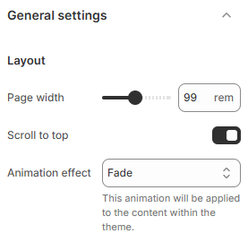

---
metaLinks:
  alternates:
    - >-
      https://app.gitbook.com/s/hbuQuZovtBBsMP54qBxh/theme-settings/general-settings
---

# General Settings

The **Theme Settings** section in Shopify allows you to fully customize the design and functionality of your store.

* **Go to** Shopify Admin > **Online Store > Themes**.
* Click **Customize** on your active theme.
* In the Theme Editor, click **Theme Settings > General settings**.

<figure><figcaption></figcaption></figure>

**Layout** : Adjust overall page structure.

| Page width       | Set the maximum width of the content container.                                             |
| ---------------- | ------------------------------------------------------------------------------------------- |
| Scroll to top    | Enable a floating button that lets users quickly scroll to the top of the page.             |
| Animation effect | Choose the animation style for theme content appearance: Fade, Fade Up, Fade Down, or None. |
